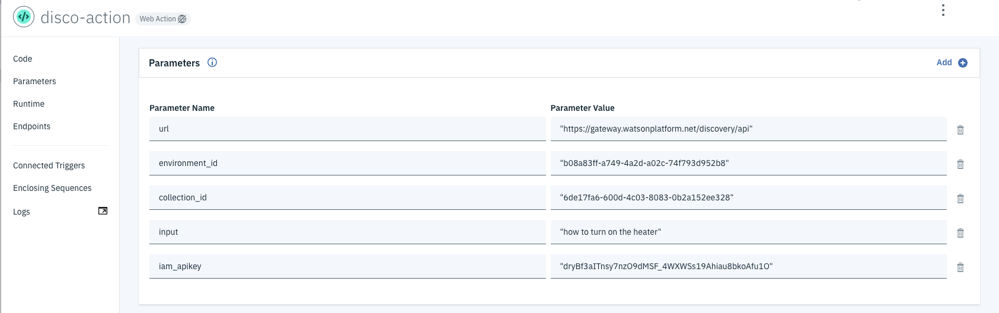
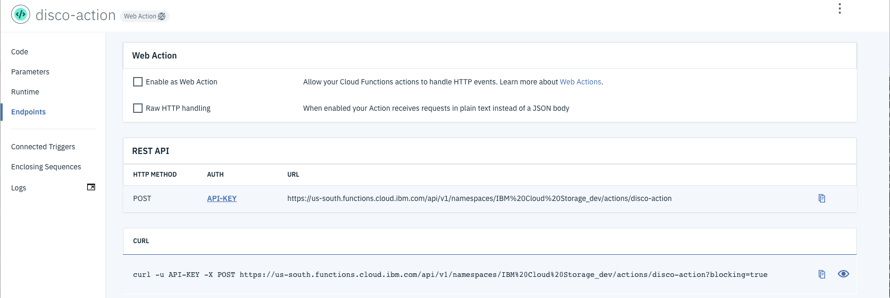
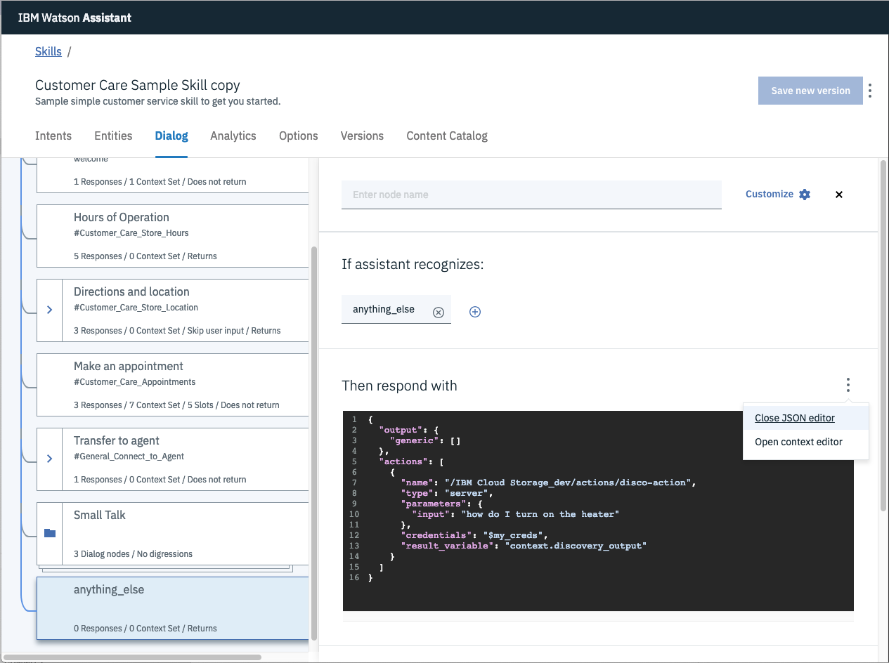
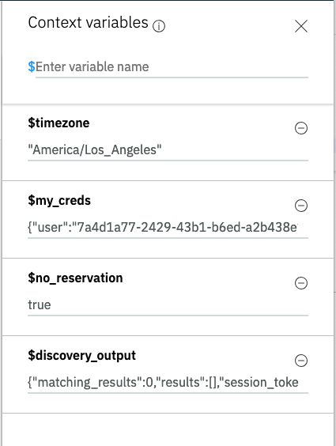

# composite-disco-sdu-assistant-chatbot

* Use Assistant dialog for better chatbot experience
* Use "customer-care" skill provided by Assistant
* Use Cloud Function to search Disco if question is "anything-else" and reply with disco passages

# TODO:

* Remove references to calling Disco directly
* Add action creds to .env
* Create better use case for invoking action from a real Assistant dialog node
* Format Disco results better in chatbot 

# Steps:

## Create action

> Note: additional notes in https://github.com/rodalton/watson-functions

* From IBM Cloud resource list, create `New` and select `Functions`.
* Click on `Actions` tab.
* `Create` and then `Create Action`.
* Provide unique `Action Name`, keep default package, and select `Node.js 10` runtime.
* Add code to action - use code in `/actions/disco-action.js`.



* Note your endpoint:



* The `curl` command should work, if the params you entered are correct for the disco collection.

## Call action from Assistant

* In the cell you want to trigger action, click on `Open JSON Editor`, and enter the following code snippet:



* Note the action `name` value of `/IBM Cloud Storage_dev/actions/disco-action`. This is derived from your endpoint name listed in the `Functions` action panel:

```https://us-south.functions.cloud.ibm.com/api/v1/namespaces/IBM%20Cloud%20Storage_dev/actions/disco-action```

Remote the host path, and translate encoded chars to ASCII (i.e. `%20` to a blank char).

* Using the `Try it` feature, add the context variable `my_creds` and see if it works (probably won't return anything meaningful in the test window, but you should NOT get an error due to credentials).

> Note: You must enter a response to trigger the assistant dialog node that calls the action.



{"user":"7a4d1a77-2429-43b1-b6ed-a2b438e15bea","password":"RVVEdpPFLAuuTwFXjjKujPKY0hUOEzt6nQ6O7NwyonHeF7OdAm77Uc34GL2wQHDx"}

These values are pulled from the `Functions` action panel, click on `API-KEY` which then takes you to the `API Key` panel, where the key is found:

```bash
7a4d1a77-2429-43b1-b6ed-a2b438e15bea:RVVEdpPFLAuuTwFXjjKujPKY0hUOEzt6nQ6O7NwyonHeF7OdAm77Uc34GL2wQHDx
```

> Note: the value before the `:` is the user, and after is the password. Do not include the `:` in either value.

## Add creds to application

* The `my_creds` needs to be passed to Assistant from your app, and needs to be placed in the Assistant context.

```javascript

    context.my_creds = {
      'user':'7a4d1a77-2429-43b1-b6ed-a2b438e15bea',
      'password':'RVVEdpPFLAuuTwFXjjKujPKY0hUOEzt6nQ6O7NwyonHeF7OdAm77Uc34GL2wQHDx'
    };

```
