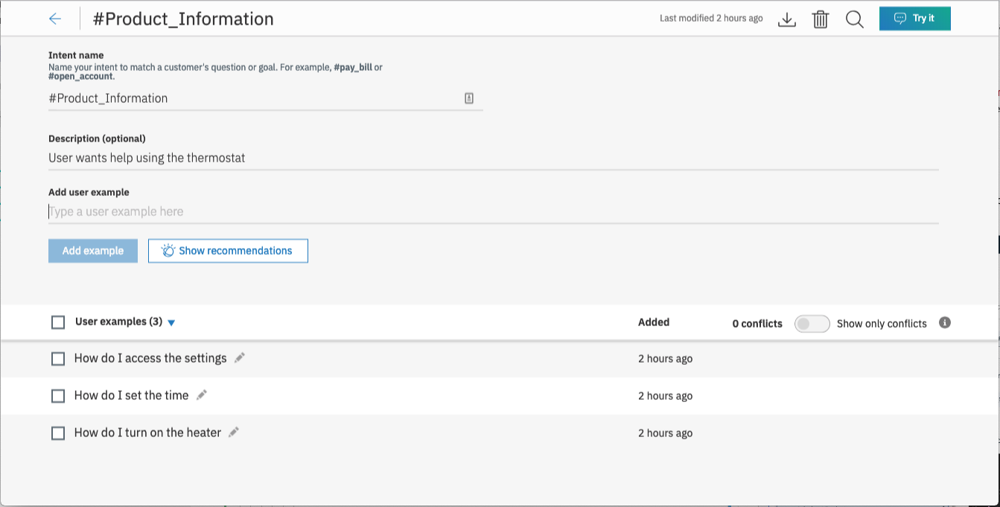

# watson-discovery-sdu-with-assistant-cloud-functions

* Use Assistant dialog for better chatbot experience
* Use "customer-care" skill provided by Assistant
* Use Cloud Function to search Disco if question is "anything-else" and reply with disco passages

# TODO:

* Remove references to calling Disco directly
* Add action creds to .env
* Get the dialog to display a header message - "Here is what I found ..."
* Create better use case for invoking action from a real Assistant dialog node
* Format Disco results better in chatbot
* Use Assistant V2 API

# Steps:

> Assumes completion of discovery setup described in https://github.com/rhagarty/watson-discovery-sdu-ui.

## Create Cloud Functions action

> Note: additional notes in https://github.com/rodalton/watson-functions

* From IBM Cloud resource list, create `New` and select `Functions`.
* Click on `Actions` tab.
* `Create` and then `Create Action`.
* Provide unique `Action Name`, keep default package, and select `Node.js 10` runtime.
* Add code to action - use code in `/actions/disco-action.js`.


* Note your endpoint:


* The `curl` command should work, if the params you entered are correct for the disco collection.

## Create new Assistant dialog skill

For this code pattern, we will be using the `Custom Care Sample Skill` that comes with the service. Either duplicate it, or use the original to complete the following steps.

### Add new intent

Create a new intent that can detect when the user is asking about operating the thermostat.



### Create new dialog node and add Cloud Functions action

Insert a new dialog node to recognize the intent we just created.

In the response section, click on `Open JSON Editor`, and enter the following code snippet:


The code snippet is:

```javascript
{
  "output": {
    "generic": [
      {
        "values": [
          {
            "text": "Here is some info I found in the manual:"
          }
        ],
        "response_type": "text",
        "selection_policy": "sequential"
      }
    ]
  },
  "actions": [
    {
      "name": "/IBM Cloud Storage_dev/actions/disco-action",
      "type": "server",
      "parameters": {
        "input": "<?input.text?>"
      },
      "credentials": "$my_creds",
      "result_variable": "context.discovery_output"
    }
  ]
}
```

* Note the action `name` value of `/IBM Cloud Storage_dev/actions/disco-action`. This is derived from your endpoint name listed in the `Functions` action panel:

```https://us-south.functions.cloud.ibm.com/api/v1/namespaces/IBM%20Cloud%20Storage_dev/actions/disco-action```

Remove the host path, and translate encoded chars to ASCII (i.e. `%20` to a blank char).

* Using the `Try it` feature, add the context variable `my_creds` and see if it works (probably won't return anything meaningful in the test window, but you should NOT get an error due to credentials).

> Note: You must enter a response to trigger the assistant dialog node that calls the action.


The format of the credentials should be the following:

```json
{"user":"7a4d1a77-2429-xxxx-xxxx-a2b438e15bea","password":"RVVEdpPFLAuuTwFXjjKujPKY0hUOEztxxxxxxxxxonHeF7OdAm77Uc34GL2wQHDx"}
```

These values are pulled from the `Functions` action panel, click on `API-KEY` which then takes you to the `API Key` panel, where the key is found:

```bash
7a4d1a77-2429-xxxx-xxxx-a2b438e15bea:RVVEdpPFLAuuTwFXjjKujPKY0hUOEztxxxxxxxxxonHeF7OdAm77Uc34GL2wQHDx
```

> Note: the value before the `:` is the user, and everthing after is the password. Do not include the `:` in either value.

## Add Cloud Function creds to application

* The Cloud Function credentials need to be assigned to the Assistant context variable name `my_creds`, and passed in from your application to the Watson Assisant API.

```javascript
    context.my_creds = {
      'user':'7a4d1a77-2429-xxxx-xxxx-a2b438e15bea',
      'password':'RVVEdpPFLAuuTwFXjjKujPKY0hUOEztxxxxxxxxxF7OdAm77Uc34GL2wQHDx'
    };
```

## Configure credentials

```bash
cp env.sample .env
```

Copy the `env.sample` file and rename it `.env` and update the `<***>` tags with the credentials from your Assistant service.

#### `env.sample:`

```bash
# Copy this file to .env and replace the credentials with
# your own before starting the app.

# Watson Discovery
ASSISTANT_WORKSPACE_ID=<add_assistant_workspace_id>
ASSISTANT_IAM_APIKEY=<add_assistant_iam_apikey>

# Run locally on a non-default port (default is 3000)
# PORT=3000
```

Credentials can be found by clicking the Service Credentials tab, then the View Credentials option from the panel of your created Watson service.

An additional `WORKSPACE_ID` value is required to access the Watson Assistant service. To get this value, select the `Manage` tab, then the `Launch tool` button from the panel of your Watson Assistance service. From the service instance panel, select the `Skills` tab to display the skills that exist for your service. For this tutorial, we will be using the `Custom Skill Sample Skill` that comes with the service:

<p align="center">
  
</p>

Click the option button (highlighted in the image above) to view all of your skill details and service credentials:


# Run locally

```bash
npm install
npm start
```

Access the UI by pointing your browser at `localhost:3000`.

Sample questions:

* **how do I set a schedule?**
* **how do I set the temperature?**
* **how do I set the time?**

# Sample Output


